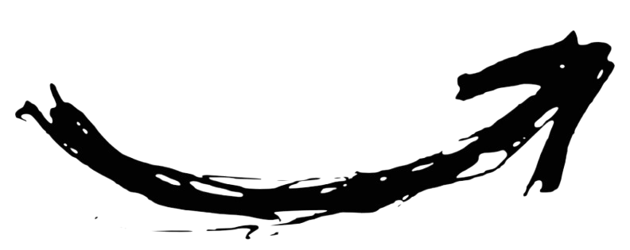

  

     
    <h3>Click <code>Here</code> For More About Me!</h3>
     
  

---

  

<kbd>

### 👤 Who am I?

- **Name :** **Ilyes**  
- **Age :** **18 ans**  
- **Role :** <kbd>🛡️ Purple Team&nbsp;|&nbsp;👾 Malware Dev&nbsp;|&nbsp;🤖 Automation Ninja</kbd>  
- **Coding Hours :** *always hacking*  
- **Root-Me Score :** <a href="https://www.root-me.org/"><kbd>+1000 ★</kbd></a>  

### 💻 My Expertise

- 🧩 **Reverse Engineering** • 🦠 **Malware Analysis**  
- 🎯 **Vulnerability Research & Exploits**  
- 🕶️ **Skills :** <kbd>Pentesting · Automation · System Admin · OSINT</kbd>  

### 🚀 Currently Exploring

- Advanced exploit dev & purple-team tactics  
- Building open-source security tools  

</kbd>

<kbd>

#### Still Learning
<kbd>🔹 **Reverse engineering & exploit development.**</kbd>

#### Community
<kbd>🔹 **CTF write-ups & mentoring.**</kbd>

#### Development
<kbd>🔹 **Cheats, malware & automation scripts.**</kbd>

#### Open Source
<kbd>🔹 **Sharing tools & docs.**</kbd>

#### Currently Exploring
<kbd>🔹 **Cloud security & CI/CD attack paths.**</kbd>

#### ↻ `Updating` : Road to full-spectrum security mastery
</kbd>

  
  
  
  
  

  <table>
    <tr>
      <td align="center"><kbd>🐧 Linux & 🪟 Windows</kbd></td>
      <td align="center"><kbd>👨‍💻 Purple Team</kbd></td>
      <td align="center"><kbd>🔐 Root-Me 1k+</kbd></td>
      <td align="center"><kbd>🛠️ 100 + Projects</kbd></td>
    </tr>
  </table>

  

  
  

### 
<code>Mostly Work With :</code>

  
  
  
  
  
  
  
  
  
  
  

